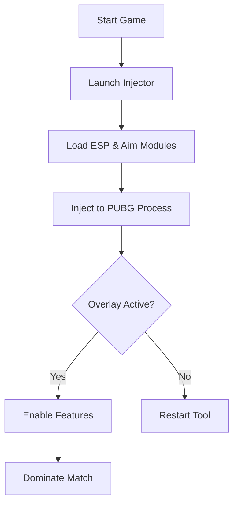

# PUBG Cheats Software for PC – Advanced ESP, Aim Assist & Injector 👁

Take control of every match with the **PUBG Cheats Software**, a pro-grade enhancement suite designed for competitive players who want precision, awareness, and consistency. Whether you’re grinding ranked or surviving intense battle royales, this tool gives you next-level visibility and aim control.

---

## ⚙️ Overview

The PUBG Cheats suite integrates **ESP (Extra Sensory Perception)**, **auto-aim modules**, and a **secure injector** into one seamless package. Built for **Windows 10/11**, it’s optimized for both **Steam** and **Krafton Launcher** versions of PUBG.
Its design ensures low CPU usage, minimal latency, and clean overlays that don’t interfere with gameplay aesthetics.

---

## 🧠 Features

### 👁 ESP Wall Vision

* Displays **player skeletons**, **loot boxes**, and **vehicles** through obstacles.
* Custom color filters (enemy red, allies blue, loot gold).
* Optional **distance markers** for better spatial awareness.

### 🎯 Aim Assist & Precision Lock

* Smooth, natural aim correction — not a jittery snap.
* Configurable **FOV radius** and **target priority** (head, chest, random).
* Adjustable **humanizer delay** to mimic real mouse movement.

### 🧩 Injector & Stealth Mode

* One-click secure injection with **anti-ban spoofing** layer.
* Automatically detects **game version updates**.
* Fully undetectable overlay built with DirectX 12 hooks.

### 🔧 Configs & Hotkeys

| Action                       | Default Key  | Editable |
| ---------------------------- | ------------ | -------- |
| Toggle ESP                   | F2           | ✅        |
| Enable Aim Assist            | Right Mouse  | ✅        |
| Panic Mode (Instant Disable) | F12          | ✅        |
| Change Target Lock           | Middle Mouse | ✅        |

[!NOTE]
Save custom profiles for sniper, SMG, and AR playstyles — ideal for tournament switching.

---

## 💻 Compatibility

| Platform            | Supported | Notes                          |
| ------------------- | --------- | ------------------------------ |
| Windows 10 (64-bit) | ✅         | Optimized for performance mode |
| Windows 11          | ✅         | DirectX 12 overlay tested      |
| Steam PUBG          | ✅         | Auto-detect injection path     |
| Krafton Launcher    | ✅         | Manual patch config required   |

[!IMPORTANT]
Run the tool **after launching the game lobby**, not before. This ensures proper memory mapping and avoids early detection triggers.

---

## ⚡️ Setup Guide

1. **Extract** the provided `.zip` file into a secure directory (not Desktop).
2. **Run as Administrator** the `Injector.exe`.
3. Select the PUBG executable from the auto-detected list.
4. Press **Inject** and wait 3–5 seconds until the overlay appears.
5. Use **F2** to toggle ESP or **F12** for Panic Mode.

Example Command:

```bash
injector.exe --process=PUBG --module=esp_core.dll --safe
```

---

## 🧭 System Flow



---

## ❓ FAQ

**Q: Is this tool safe from bans?**
A: The injector uses **kernel-level obfuscation** and **signature rotation**, minimizing risk. However, no external tool can guarantee 100% safety.

**Q: Can I use it on low-end PCs?**
A: Yes, the cheat is optimized to run with minimal GPU overhead (<3% impact).

**Q: Do I need to disable antivirus?**
A: Temporarily, yes — most AVs flag injectors as false positives.

**Q: How often are updates released?**
A: Updates follow PUBG patches, usually within **24 hours** after each release.

**Q: Can I customize the ESP colors?**
A: Absolutely — use the in-game config panel or edit `/configs/esp.ini`.

---

## 🧩 Advanced Tips

* Combine **FOV = 45°** and **delay = 85ms** for realistic aiming.
* Disable ESP for teammates in duos/squads to reduce clutter.
* Use **Panic Mode** before alt-tabbing to avoid display freezes.

[!WARNING]
Using public versions of outdated injectors may trigger detection. Always verify your build in the official channel.

---

## 🚀 Final Thoughts

The **PUBG Cheats Software** transforms how you approach every encounter — no more guessing enemy positions or struggling with recoil. It’s the balance of stealth, accuracy, and awareness built into one clean interface.

---

**Stay ahead, stay unseen — dominate every drop zone with precision and control.**
